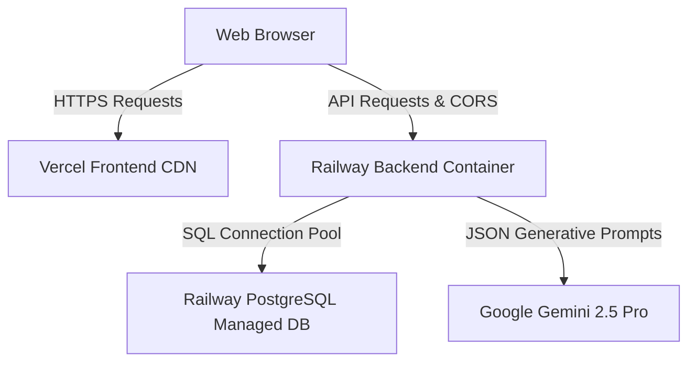

# Deployment Guide: LUMEN AI Production Infrastructure

This handbook outlines the production architecture and step-by-step processes to deploy **LUMEN AI** as a secure, containerized, and high-performance platform.

---

## 🏗️ Production Architecture Overview



---

## 🗄️ Database Setup (PostgreSQL)

LUMEN AI uses a PostgreSQL instance in production with optimized indexing on foreign key constraints.

### 1. Provision Database
You can provision a managed PostgreSQL database using **Railway**, **Supabase**, or **AWS RDS**:
- Create a database named `lumen_ai`.
- Secure your credentials and note the Connection URI:
  `postgresql://<username>:<password>@<host>:<port>/lumen_ai`

### 2. Initialize Database & Seed
Run the standalone database initialization script from the backend environment to build schemas, tables, and populate standard user roles:
```bash
cd backend
python -m app.database.init_db
```

---

## 💻 Backend Deployment (FastAPI on Railway)

The backend runs inside a container managed by Uvicorn.

### 1. Configure Railway Environment
Create a new service on Railway connected to your backend repository branch. Add the following **Environment Variables**:

| Variable | Recommended Value / Purpose |
| :--- | :--- |
| `SECRET_KEY` | A long random string to sign JWT tokens securely. |
| `DATABASE_URL` | The PostgreSQL connection string created in the DB step. |
| `GEMINI_API_KEY` | Your Google AI Studio API Key. |
| `ALLOWED_ORIGINS` | `https://your-vercel-subdomain.vercel.app` (Your frontend URL). |
| `ACCESS_TOKEN_EXPIRE_MINUTES` | `60` (Token validity duration). |

### 2. Deploy Container
Railway will automatically read the root [Dockerfile](file:///e:/LUMEN-AI/backend/Dockerfile) and build a lightweight Python container exposed on port `8000`.

### 3. Verify Health
Verify that the service is running by navigating to the health check endpoint:
`https://your-railway-app.railway.app/health`

---

## 🌐 Frontend Deployment (Vite + React on Vercel)

The frontend is served from Vercel's global CDN with client-side SPA routing overrides.

### 1. Configure Vercel Project
Create a new Vercel project connected to the frontend repository branch:
- **Framework Preset:** Vite
- **Root Directory:** `frontend`
- **Build Command:** `npm run build`
- **Output Directory:** `dist`

### 2. Add Environment Variables
Add the following key in Vercel settings:

| Variable | Recommended Value |
| :--- | :--- |
| `VITE_API_URL` | `https://your-railway-app.railway.app/api` (Point to your backend API URL). |

### 3. Deploy
Trigger a deploy. Vercel will build the React bundles and configure secure caching headers and SPA redirects as defined in the [vercel.json](file:///e:/LUMEN-AI/frontend/vercel.json) manifest.

---

## 🔒 Security Checklist for Production

1. **HTTPS Enforcement:** Always ensure all traffic goes over HTTPS (enforced by default on Vercel and Railway).
2. **CORS Origins:** Avoid setting `ALLOWED_ORIGINS` to wildcard `*` in production. Always restrict it to your frontend domain.
3. **API Secrets:** Ensure `SECRET_KEY` and `GEMINI_API_KEY` are kept inside environment variables and never committed to source files.
