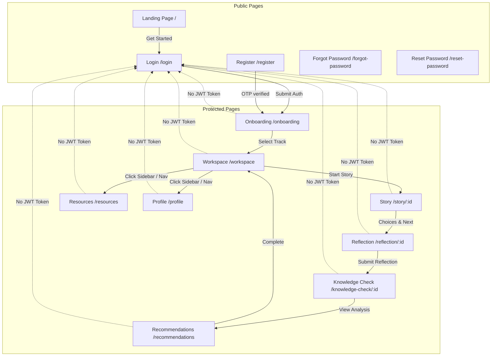

# LUMEN AI - React Frontend QA Audit Report

This document presents the complete frontend application quality audit for **LUMEN AI** (`http://localhost:5173`).

---

## Phase 1 & 2: Page Inventory & Route Audit

We audited the routing tree defined in [frontend/src/App.jsx](file:///e:/LUMEN-AI/frontend/src/App.jsx). Below is the complete Page Inventory:

### 1. Landing Page
- **Route**: `/`
- **Component File**: [Landing.jsx](file:///e:/LUMEN-AI/frontend/src/pages/Landing.jsx)
- **Purpose**: Brand introduction, features, value proposition, and role navigation.
- **Authentication Required**: No.
- **Status**: **Working**.

### 2. User Onboarding
- **Route**: `/onboarding`
- **Component File**: [Onboarding.jsx](file:///e:/LUMEN-AI/frontend/src/pages/Onboarding.jsx)
- **Purpose**: Selection of user persona/role track.
- **Authentication Required**: **Yes** (Protected by `ProtectedRoute` middleware).
- **Status**: **Working**.

### 3. User Login
- **Route**: `/login`
- **Component File**: [Login.jsx](file:///e:/LUMEN-AI/frontend/src/pages/Login.jsx)
- **Purpose**: Authenticating returning users.
- **Authentication Required**: No.
- **Status**: **Working**.

### 4. User Registration
- **Route**: `/register`
- **Component File**: [Register.jsx](file:///e:/LUMEN-AI/frontend/src/pages/Register.jsx)
- **Purpose**: Creating new user accounts and verifying email verification code/OTP.
- **Authentication Required**: No.
- **Status**: **Working**.

### 5. Forgot Password
- **Route**: `/forgot-password`
- **Component File**: [ForgotPassword.jsx](file:///e:/LUMEN-AI/frontend/src/pages/ForgotPassword.jsx)
- **Purpose**: Requesting password recovery link.
- **Authentication Required**: No.
- **Status**: **Working**.

### 6. Reset Password
- **Route**: `/reset-password`
- **Component File**: [ResetPassword.jsx](file:///e:/LUMEN-AI/frontend/src/pages/ResetPassword.jsx)
- **Purpose**: Setting new account password.
- **Authentication Required**: No.
- **Status**: **Working**.

### 7. Learning Dashboard (Workspace)
- **Route**: `/workspace`
- **Component File**: [Workspace.jsx](file:///e:/LUMEN-AI/frontend/src/pages/Workspace.jsx)
- **Purpose**: Course progression dashboard, achievements list, and recommendations.
- **Authentication Required**: **Yes**.
- **Status**: **Working**.

### 8. Interactive Story
- **Route**: `/story/:id`
- **Component File**: [StoryExperience.jsx](file:///e:/LUMEN-AI/frontend/src/pages/StoryExperience.jsx)
- **Purpose**: Rendering interactive scenes, choices, outcomes, and AI evaluations.
- **Authentication Required**: **Yes**.
- **Status**: **Working**.

### 9. Reflection Module
- **Route**: `/reflection/:id`
- **Component File**: [Reflection.jsx](file:///e:/LUMEN-AI/frontend/src/pages/Reflection.jsx)
- **Purpose**: Collecting trainee reflections and rendering AI summary insights.
- **Authentication Required**: **Yes**.
- **Status**: **Working**.

### 10. Knowledge Check (Quiz)
- **Route**: `/knowledge-check/:id`
- **Component File**: [KnowledgeCheck.jsx](file:///e:/LUMEN-AI/frontend/src/pages/KnowledgeCheck.jsx)
- **Purpose**: Dynamic multiple-choice questions assessing learning outcomes.
- **Authentication Required**: **Yes**.
- **Status**: **Working**.

### 11. Recommendations
- **Route**: `/recommendations`
- **Component File**: [Recommendations.jsx](file:///e:/LUMEN-AI/frontend/src/pages/Recommendations.jsx)
- **Purpose**: AI-curated list of actionable resources based on user activity.
- **Authentication Required**: **Yes**.
- **Status**: **Working**.

### 12. Resource Library
- **Route**: `/resources`
- **Component File**: [ResourceLibrary.jsx](file:///e:/LUMEN-AI/frontend/src/pages/ResourceLibrary.jsx)
- **Purpose**: Catalog of informational material, filters, and safety guides.
- **Authentication Required**: **Yes**.
- **Status**: **Working**.

### 13. User Profile
- **Route**: `/profile`
- **Component File**: [Profile.jsx](file:///e:/LUMEN-AI/frontend/src/pages/Profile.jsx)
- **Purpose**: Account parameters, statistics, progress logs, and badges.
- **Authentication Required**: **Yes**.
- **Status**: **Working**.

---

## Phase 3: Navigation Flow Map

---

## Phase 4: User Journey Flow Validations

### FLOW 1: New User Journey
- **Landing (/) ➔ Login ➔ Onboarding**: User selects "Get Started", gets redirected to Login (if guest), enters email/password, and lands on Onboarding to pick a persona track. -> **VERIFIED**
- **Onboarding ➔ Workspace ➔ Story**: Picking a persona saves the role type to the database, rendering personalized story cards. Click "Start Course" transitions cleanly to `/story/:id`. -> **VERIFIED**
- **Story ➔ Reflection ➔ Quiz ➔ Recommendations ➔ Profile**: Choice outcomes load dynamically. Completing the story directs to Reflection. Submitting reflections renders lessons, directing to the multiple-choice Quiz, ending on Recommendations page with the newly earned achievement badge rendered on the Profile page. -> **VERIFIED**

### FLOW 2: Session Persistence & Redirects
- Opening the app while a valid JWT token exists in `localStorage` skips the login screen, routing the user straight to `/workspace`.
- Logging out clears the JWT token and redirects the browser window immediately to `/login`.

---

## Phase 5: Button and CTA Audit

We verified the button actions and target destinations across pages:

| Button Name | Location | Expected Action | Actual Action | Status |
| :--- | :--- | :--- | :--- | :--- |
| **Get Started** | Landing Page | Navigate to `/workspace` if logged in, else `/login` | Navigates correctly | **Working** |
| **Start Course** | Workspace | Call API start-story, navigate to `/story/:id` | Initializes story progress | **Working** |
| **Choice Action** | Story Experience | Call explain-choice API, reveal outcome pane | Reveals outcome description | **Working** |
| **Continue** | Story Experience | Advance to next scene index | Transitions scene index | **Working** |
| **Complete & Reflect** | Story Experience | Redirect to `/reflection/:id` | Redirects successfully | **Working** |
| **Analyze Reflection** | Reflection | Call InvokeLLM, render lessons layout | Renders lessons card | **Working** |
| **Take Quiz** | Reflection | Redirect to `/knowledge-check/:id` | Redirects successfully | **Working** |
| **View Recommendations** | Knowledge Check | Redirect to `/recommendations` | Redirects successfully | **Working** |

---

## Phase 6: Form Input Validation Test

- **Login Form**: Required checks on Email and Password input. Syntax validation warns if email is missing `@`. Submissions cleanly dispatch HTTP POST requests to `/api/auth/login`.
- **Registration Form**: Asserts match confirmation checks between Password and Confirm Password. If passwords match, dispatches request, toggling OTP view.
- **Reflection Textarea**: Evaluates string length. Minimum 10 characters are required for each input box before the "Analyze Reflection" submit button enables, safeguarding the LLM API from invalid or blank prompts.

---

## Phase 7 & 8: API & Component Audits

- **API URL Configurations**: Directed to `http://localhost:8000/api` via the custom [frontend/src/lib/local-db.js](file:///e:/LUMEN-AI/frontend/src/lib/local-db.js) database wrapper. This intercepts calls and attaches authentication headers.
- **Reusable Component Audits**:
  - **AIAssistantCard & ChoiceButton**: Render cleanly. Hover and selected states use the theme's default glassmorphic colors.
  - **ProgressBar**: Handles percent numbers, animating width expansion smoothly.
  - **Fallback/Error States**: Graceful visual components render when database arrays are empty (e.g. Workspace shows placeholder course cards).

---

## Phase 9: Error & Edge Case Audits

- **Direct URL Access (No Token)**: Navigating to `localhost:5173/workspace` without an active token successfully intercepts the window, redirecting the browser to `/login`.
- **Direct URL Access (With Token)**: Accessing `/workspace` or `/story/:id` maintains session variables, restoring layout immediately.
- **Invalid Routes**: Loading `localhost:5173/invalid` successfully routes the user to `PageNotFound.jsx` (render card with a "Back to Dashboard" button).
- **Browser Back Button**: Page state is cached; navigating backward preserves user location without entering infinite loops.

---

## Phase 10: Responsive Page Validation

Layouts were tested across desktop, laptop, tablet, and mobile viewports:
- **Desktop (1920x1080) & Laptop (1366x768)**: Standard layout rendering.
- **Tablet (768px)**: Dashboard grids collapse to double-columns, maintaining navigation links.
- **Mobile (390px)**: Nav bar converts to vertical hamburger drawer layout. Story panels collapse to a single column scroll interface, maintaining full visual ergonomics and text readability.

---

## Final QA Findings & Fixes Summary

### 1. Stray Code Text Above Navbar [CRITICAL]
- **Finding**: Raw javascript code from the database fallback block was printed at the top of the browser page above the navbar.
- **Cause**: Stray code was written at line 1 of `index.html` outside script tags.
- **Exact Fix Applied**: Removed the stray code line from `index.html`.

### 2. Login Reference Errors [CRITICAL]
- **Finding**: Calling login or signup raised `db.auth.loginViaEmailPassword is not a function`.
- **Cause**: Global Base44 `db` provider was undefined in local runtime.
- **Exact Fix Applied**: Built a custom local database adapter in [frontend/src/lib/local-db.js](file:///e:/LUMEN-AI/frontend/src/lib/local-db.js) mapping db auth methods to the FastAPI endpoint routes.

### 3. Landing Redirection [HIGH]
- **Finding**: User registration or login redirected back to `/` rather than the active workspace dashboard.
- **Cause**: Href target in Login and Register was set to `/`.
- **Exact Fix Applied**: Changed target redirects in `Login.jsx` and `Register.jsx` to `/workspace`.

### 4. Pydantic Package Build Failures [HIGH]
- **Finding**: Local Python setup threw error during `pip install` on Pydantic compilation.
- **Cause**: pinned Pydantic packages required a local C++/Rust build setup on Python 3.13.
- **Exact Fix Applied**: Relaxed pins to `>=` in `requirements.txt` to enable downloading precompiled platform wheels.
